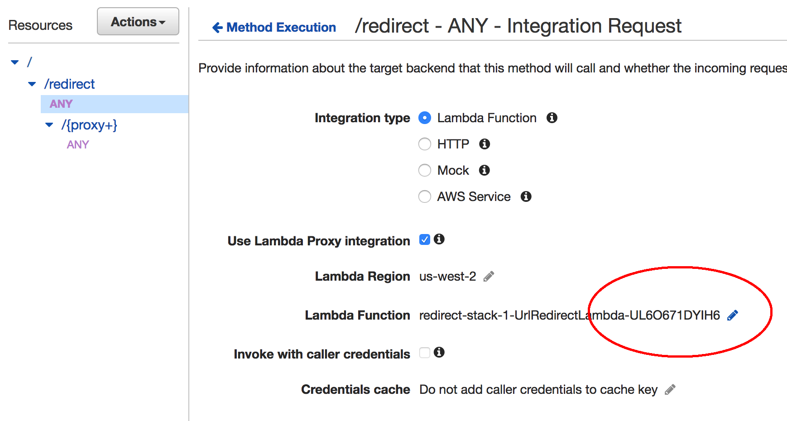

## Background


fully serverless bit.ly clone for fun
(e.g. redirects tokens to a URL bit.ly/neat)
so I built a bit.ly clone

I also wanted the ability to create a custom token so I could obfuscate long s3 urls, 1strategy.com, other random domains, but also have a name that made sense.
works with custom domain

The serverless URL redirect tool consists of the below services:


######  API Gateway
* API gateway serves the website
* Proxy passthrough /{proxy+}
* Everything is passed to your backend resource (in this case, our lambda function) as a JSON document including entire resource path (example.com **/resource/subresource/subsubresource/**), query string parameters, headers, etc.


```JSON
{
    "body": "{\"test\":\"body\"}",
    "resource": "/{proxy+}",
    "requestContext": {
      ...
      "identity": {
        ...
      },
      "stage": "prod"
    },
    "queryStringParameters": {
      "foo": "bar"
    },
    "headers": {
      ...
    },
    "pathParameters": {
      "proxy": "path/to/resource"
    },
    "httpMethod": "POST",
    "path": "/path/to/resource"
}

```

When using a {proxy+} resource, API Gateway expects a specific return payload (seen below). If anything else is returned, API gateway will return a 500 error and the logs will show a malformed lambda response. Your code will need to formulate the proper status and headers based on what you're trying to accomplish. In this case, the function returns a statusCode of 200 or 301 depending on whether or not a given token exists.

```JSON    
    {
        "statusCode": 200|301|404,
        "headers":{
          "Content-Type": "text/html",
          ...
        },
        "body": "<html>...</html>"
    }```

#####    Lambda has the logic

  GET<br>
  Returns an html page<br>
  POST<br>

>**Note** Although a simple use case, what I've written is actually more of a monolithic app or function. This makes it very easy to break the API and harder to test. From an architecture standpoint Makes more sense to have a different function at each level

##### DynamoDB
Stores the token/url mapping
(id, destination_url)

##### Deploy it for your own use

[github](https://github.com/1Strategy/redirect)

##### SAM Template

Bug with SAM for proxy resources where it doesn't properly provision API gateway permissions to your lambda function.

* Press on the pencil icon next to the lambda function:


* Press the checkbox to the right of the lambda function


* A pop-up will prompt you to give API gateway invocation permissions on your lambda function. Press OK.


The endpoint will now display correctly.
